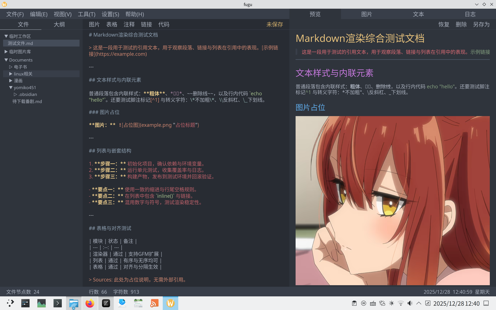

一个基于iced的简单md编辑器，早期随缘施工中……

完全基于个人需求打造，可能不适合大多数人，一般日用更建议`typora`或者`obsidian`

个人需求如下，如果你也有类似需求可以试试

- 可读性优先，美观性次之，字要大，对必要柔和
- 省略一切不必要的图标、留白，尽可能利用所有空间
- 省略一切动画效果，交互反馈尽可能简单直接

也许你会好奇为什么叫`fugu`,请看我头像  
功能上比较简单，除了基本的文件操作+md编辑预览，就多了两个图片素材和文本素材的管理面板，这样写起md文档会方便点  
app大概长这样，我个人比较满意，但客观说确实没有任何设计与美感可言23333

待实现功能

- 右键菜单，需要等待官方更新相关功能，自己用overlay窗口模拟效果不是很好，事件传播难做，尝试`iced_aw`的`context_menu`效果也不理想
- 编辑和预览面板同步滚动
- 读取文件树添加防止爆栈逻辑
- 编辑器区各种快捷键，比如tab缩进四空格
- 编辑区撤销/重做功能
- 编辑区文本搜索/替换功能
- 编辑区中英文混杂时行高问题
- 文件模块大纲功能
- md渲染行内代码padding只对背景生效问题，等待官方api改进或自己改源码，字段名叫inline_code_padding却只对背景容器生效，遭不住
- md渲染自定义viewer的表格方法中参数row::cell字段私有问题，等待官方api改进或改源码，这个问题感觉是个bug啊，明明column内部字段全是公开的，没道理row内部字段搞成私有，而且拿不到row.cell根本没法做自定义列表渲染
- 打包noto-cjk jb-mono字体，还在考虑选什么字体
- 浅色主题与主题切换，鄙人没有审美，配色都是随缘
- 其他还没想到的问题，还有不少没实现的，反正是自娱自乐，慢慢来吧

考虑实现功能

- 统一使用Catalog管理样式
- 导出md文件为pdf